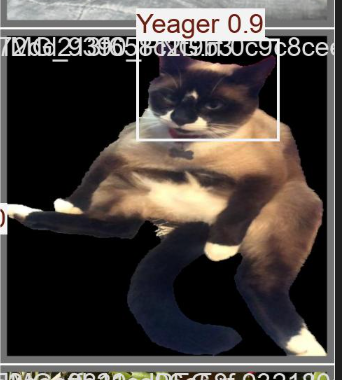

# CAT CLASS

## Troubleshooting
Setting up a camera in WSL2 is tricky
In powershell: 
`usbipd list`
`usbipd attach --wsl --busid {BUSID}`

In WSL:
`lsusb`
`ls /dev/video*`
`sudo chmod 666 /dev/video0`

